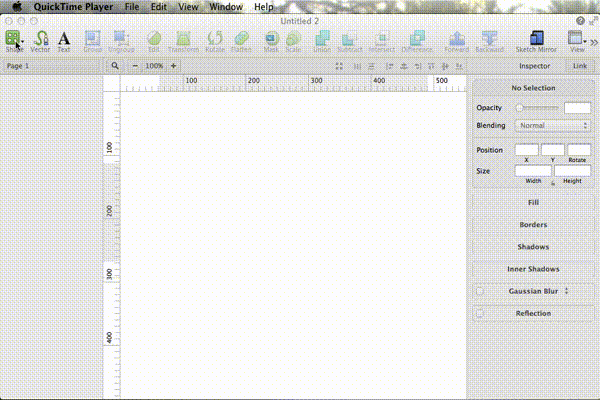

Sketch Interpolate Paths Plugin
===============================

This plugin attempts to recreate the "interpolate path" feature which may be
known from tools like Adobe Illustrator for the otherwise brilliant [Sketch
app](http://bohemiancoding.com/sketch).

The plugin will eventually be able to generate a stepwise interpolation between
two selected paths. Below is a proof-of-concept animation using a very early
version of the script:

The interpolation seen in the animation is by no means perfect yet.

Usage: put the .sketchplugin file into the Plugins folder of your Sketch app.
Execute from Sketch's Plugin menu after selecting two paths.
